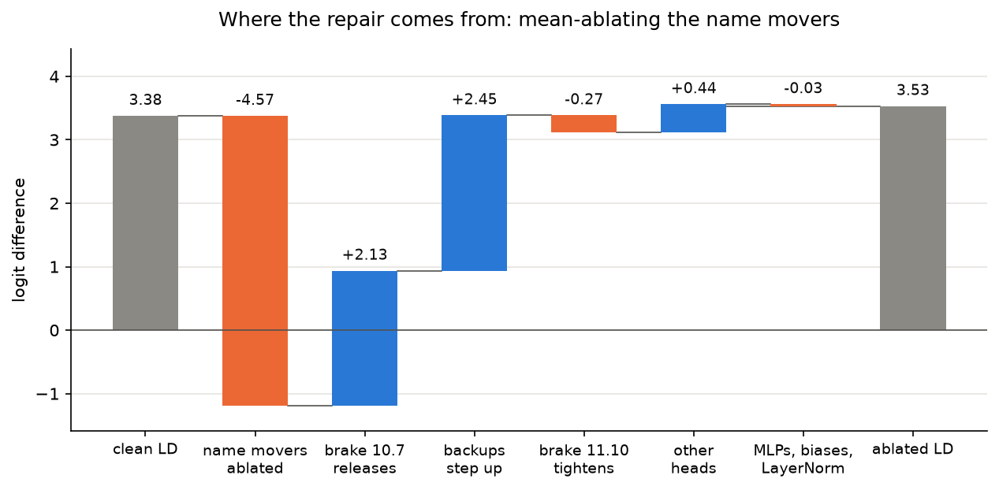

# IOI + the Hydra effect in GPT-2 small

One-day project: reproduce the Indirect Object Identification (IOI) circuit in GPT-2 small ([Wang et al. 2022](https://arxiv.org/abs/2211.00593)),
then measure self-repair ([McGrath et al. 2023, "The Hydra Effect"](https://arxiv.org/abs/2307.15771))
when the name-mover heads are ablated, with bootstrap CIs and ablation-method / template / seed systematics.

**Results: [docs/results.md](docs/results.md).** Headline: ablating the three name-mover heads removes 4.6 logits
of direct effect, but the logit difference doesn't drop; the network repairs 103% (+4/−3%) of the damage.

## Setup

    source setup.sh

The first time, this creates `.venv`, installs `requirements.txt` (including TransformerLens, pinned to
a git commit), and registers the `ioi-hydra` Jupyter kernel. After that it just activates the venv and sets `PATH` (`scripts/`) and
`PYTHONPATH` (`python/`). To rebuild from scratch: `rm -rf .venv && source setup.sh`.

## Run

    jupyter lab notebooks/ioi_hydra.ipynb    # interactive; use the "Python (ioi-hydra)" kernel
    run-notebook                             # headless; executed copy goes to results/

About 4 minutes end to end on CPU on an M4.

## Layout

    python/ioi_hydra.py         helpers: dataset, patching, direct effects, ablations, bootstrap
    notebooks/ioi_hydra.ipynb   the analysis
    scripts/run-notebook        headless execution
    docs/results.md             write-up; figures in docs/figures/ are regenerated by the notebook

Note: TransformerLens 4.0 removed `HookedTransformer`. Load models with
`TransformerBridge.boot_transformers("gpt2")`, then call `enable_compatibility_mode()`.

2026/10/04      
Ryan Reece

