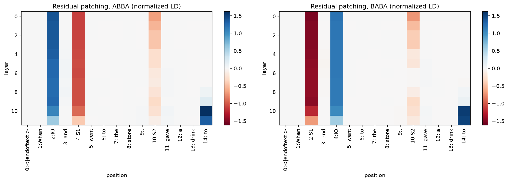
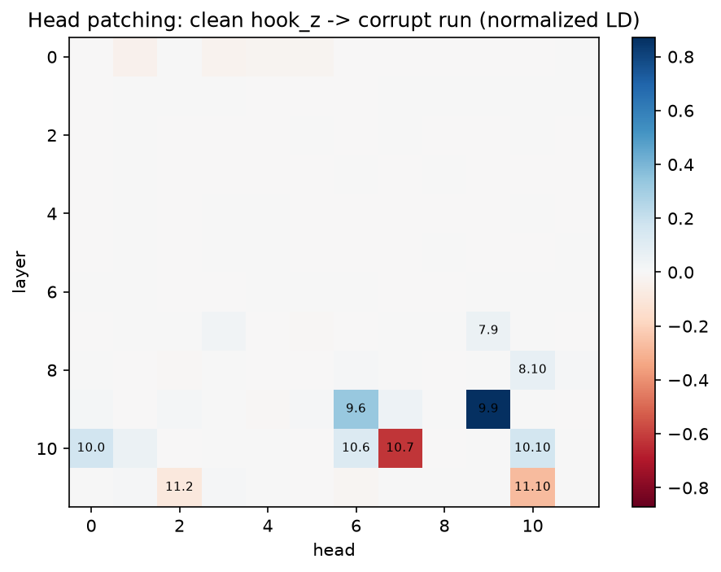
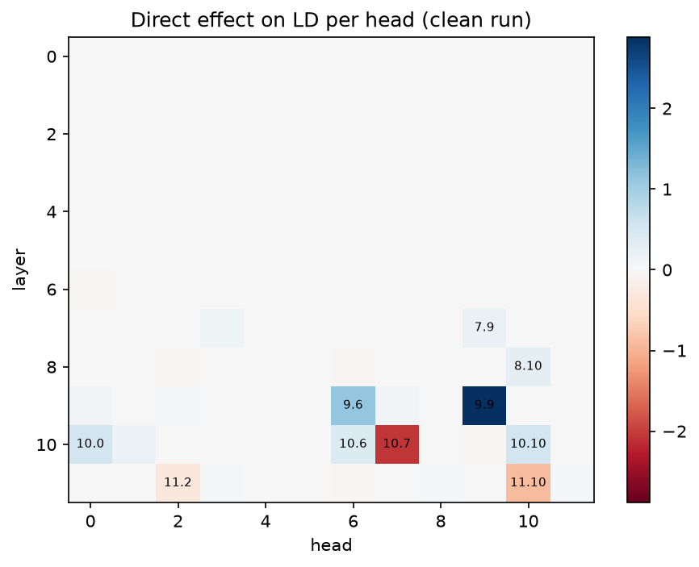
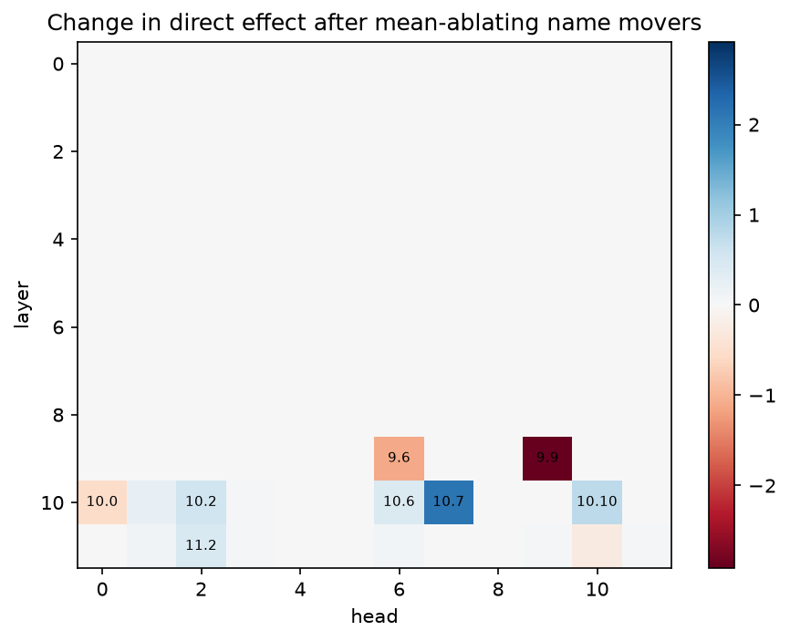
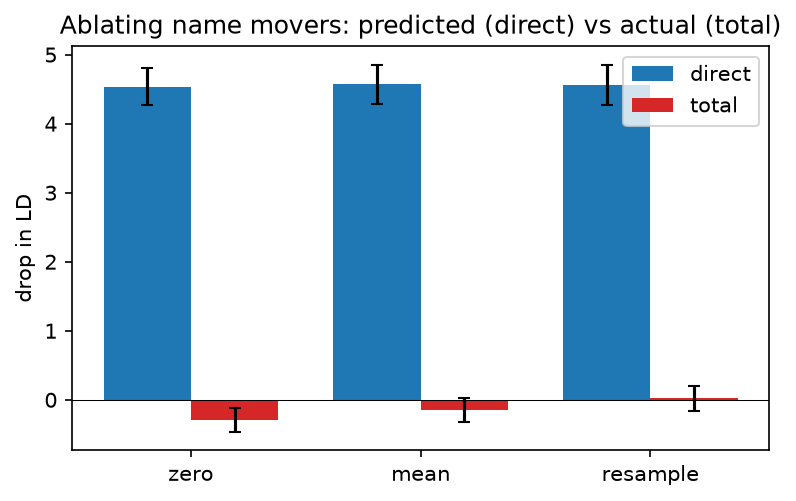

# Self-repair in GPT-2 small's IOI circuit

*Ryan Reece, 2026-10-04. All numbers are produced by [`notebooks/ioi_hydra.ipynb`](../notebooks/ioi_hydra.ipynb);
see [Reproducing](#reproducing).*

## Summary

GPT-2 small completes *"When Susan and Robert went to the store, Robert gave a drink to"* with *Susan*, using a known
circuit ([Wang et al. 2022](https://arxiv.org/abs/2211.00593)). I reproduced that circuit with TransformerLens 4.x and
then asked how much the rest of the network compensates when the heads that write the answer are removed
([McGrath et al. 2023, "The Hydra Effect"](https://arxiv.org/abs/2307.15771)).

- **Ablating the three name-mover heads removes 4.6 logits of direct effect, but the model's logit difference does
  not drop at all** (−0.15 ± 0.2). The network repairs **103% (+4/−3%)** of the damage.
- About **45%** of the repair is the negative name mover **10.7 releasing its brake**: it normally pushes the
  answer down by 2.1 logits and goes quiet when the name movers are gone. The other **55%** comes from **backup name
  movers** (10.10, 10.2, 11.2, 10.6, 10.1) stepping up.
- **Head interactions are large and come in both signs**: redundancy (the joint effect exceeds the sum of single
  effects), dependency (one head's effect depends on another), and saturation (the sum of single effects
  exceeds the joint effect).
- The headline holds across **ablation method** (zero / mean / resample), **8 prompt templates**, and **4 dataset
  seeds**.

**Takeaway.** Judged by direct logit attribution, the name movers carry 4.5 logits. Judged by ablation, they don't
matter. Both readings are wrong; what matters is how the rest of the network responds. Any automated or
single-method assessment of "how important is this component" needs to measure that response.

All uncertainties are 95% percentile-bootstrap intervals over prompts (5000 resamples). *N* = 128 prompts.

## Setup

**Model.** GPT-2 small (124M), loaded with `TransformerBridge.boot_transformers("gpt2")` and
`enable_compatibility_mode()` (LayerNorm folded, so numbers match the legacy `HookedTransformer` and the papers).

**Prompts.** 8 templates × 16 prompts, balanced between ABBA and BABA name orders, using names that are a single
GPT-2 token.

| | example | answer |
|---|---|---|
| **clean** (ABBA) | When **Susan** and **Robert** went to the store, **Robert** gave a drink to | Susan |
| **clean** (BABA) | When **Jessica** and **Alice** went to the store, **Jessica** gave a drink to | Alice |
| **corrupt** (ABC) | When **Anthony** and **Betty** went to the store, **Thomas** gave a drink to | — |

Each clean prompt is paired with a corrupt prompt built from the same template, with all three name slots
replaced by fresh, distinct names. The corrupt prompt keeps the grammar, length and token positions, but removes
the one cue IOI depends on (which name is repeated). It is the control sample for patching and ablation.

**Metric.** Logit difference LD = logit(IO) − logit(S) at the final token, always using the clean pair's IO and S.
Normalized LD rescales this so that corrupt = 0 and clean = 1.

**Ablations** replace a head's output (`hook_z`, at all positions) with:
- **zero**: 0
- **mean**: its mean over the corrupt prompts of the same template, per position (as in Wang et al.)
- **resample**: its value on the matched corrupt prompt

**Direct effect (DE)** of a component is how far its output, on its own, pushes the IO logit above the S logit. It
is defined as follows. At the final position, the residual stream entering the final LayerNorm is a sum of
everything written into it:

$$x = \text{embeddings} + \sum_{\text{heads } h} o_h + \sum_{\text{MLPs } m} o_m + \text{biases}, \qquad o_h = z_h W_O^{h}$$

where $z_h$ is head $h$'s output (`hook_z`) at the final position and $W_O^{h}$ its output projection. With
compatibility mode, the LayerNorm weight and bias are folded into $W_U$ and $b_U$, so the final LayerNorm is just
centering and scaling:

$$\text{LN}(x) = \frac{x - \bar{x}}{\sigma(x)}, \qquad \text{logits} = \text{LN}(x)\, W_U + b_U$$

where $\bar{x}$ is the mean over the 768 dimensions and $\sigma(x)$ the LayerNorm scale. Writing
$\Delta w = W_U[:, \text{IO}] - W_U[:, \text{S}]$, the logit difference is

$$LD = \frac{(x - \bar{x}) \cdot \Delta w}{\sigma(x)} + (b_U[\text{IO}] - b_U[\text{S}])$$

Centering is linear, so for a fixed $\sigma$ this splits exactly into one term per component:

$$LD = \sum_{c} DE_c + (b_U[\text{IO}] - b_U[\text{S}]), \qquad DE_c = \frac{(o_c - \bar{o}_c) \cdot \Delta w}{\sigma(x)}$$

Every component shares the same denominator $\sigma(x)$, taken from the run being analysed (clean or ablated). The
*direct* effect counts only the path straight to the logits; a component that changes the answer by changing what
later components do has an indirect effect that DE does not see. Implemented in `head_direct_effects` in
[`python/ioi_hydra.py`](../python/ioi_hydra.py).

## Results

### 1. Baseline

| | LD |
|---|---|
| clean | **3.38** [3.14, 3.61], with LD > 0 on 99.2% of prompts |
| corrupt | **−0.05** [−0.33, 0.24] |

This matches the ~3.5 reported by Wang et al. The corrupt prompts carry no IOI information, as designed.

**Template spread is a systematic.** Per-template LD ranges from 2.25 [1.78, 2.77] (*"The local big house where A
and B lived was quiet. S handed a key to"*) to 4.15 [3.39, 4.92] (*"When A and B went to the park, S gave a ball
to"*). That is well beyond the per-template statistical error, so a single-template study would understate the
uncertainty on the baseline.

### 2. Residual-stream patching



Clean `resid_pre` is patched into the corrupt run at one (layer, position) at a time. This uses template 0 only, so
that positions line up, with ABBA and BABA plotted separately because the IO and S1 slots swap between them. Each
panel is normalized by its own clean and corrupt LD. Values above 1 mean the patch does *better* than the clean run.

- **The answer reaches the final token (`to`) at layers 9–10, and overshoots.** Patching that position does nothing
  before layer 8, recovers 0.04–0.19 at layers 8–9, then jumps to **1.62 (ABBA) / 1.53 (BABA)** at layer 10. The
  overshoot is copy suppression ([§4](#4-direct-logit-attribution)) failing to engage. The patched state carries
  "Susan" from the name movers, but the negative name movers 10.7 and 11.10 suppress a name by attending to it in the
  context, and the corrupt context contains no Susan. The brake that costs the clean run about 3 logits has nothing
  to grip. At layer 11 (1.33 / 1.50), 10.7's braking is already in the patched state and only 11.10's is missing.
- **Single name positions carry the largest effects, ±1.1 to 1.5.** Patching the IO slot puts the IO name into the
  corrupt context once, and the model copies it, a large positive effect. Patching S1 does the same for S, a large
  negative one. Both fade at layers 10–11, after the name movers have read those positions. *(An earlier version of
  this plot averaged ABBA with BABA, which cancelled these effects to about 0.)*
- **The S2 column traces the circuit's timing.** Patching S2 (the repeated name) is strongly negative at layer 0
  (−0.66 ABBA / −0.71 BABA), weakens to −0.15 / −0.01 by layer 7, is negative again at layer 9 (−0.31 in both), and
  fades at layer 11. My reading:
  early on, the patch inserts only the *token* S, appearing once, which the model copies. By layers 5–7 the patched
  state also carries the "this name is a repeat" flag written by the duplicate-token and induction heads, which the
  S-inhibition heads (layers 7–8) read and use to steer the name movers away from S. From layer 8 on, the flag
  arrives after the S-inhibition heads have already read that position, but the token is still there for the name
  movers (layers 9–10) to copy. This interpretation fits the layer timing but is not directly tested.
- **This is partly an artifact of the corruption.** ABC changes two things at once (the repetition *and* the name
  tokens), so patching a name position also inserts a name. An ABB → ABA corruption, which flips which name is
  repeated while keeping the same names, would isolate the repetition cue (see [Next steps](#next-steps)).

### 3. Per-head patching



Each head's clean output is patched into the corrupt run (denoising).

| head | role (Wang et al.) | normalized LD recovered |
|---|---|---|
| 9.9 | name mover | **0.87** [0.78, 0.97] |
| 9.6 | name mover | 0.33 [0.25, 0.41] |
| 10.0 | name mover | 0.17 [0.08, 0.25] |
| 10.10 | backup name mover | 0.16 [0.08, 0.24] |
| 10.6 | backup name mover | 0.12 [0.03, 0.21] |
| 8.10, 7.9, 7.3 | S-inhibition | 0.03–0.07, consistent with 0 |
| 11.10 | negative name mover | −0.27 [−0.37, −0.18] |
| 10.7 | negative name mover | **−0.62** [−0.72, −0.53] |

The circuit's output heads reproduce. Two observations:

**In this experiment, a head's patching effect equals its direct effect.** This heatmap looks almost identical to the
DLA heatmap in §4: across all 144 heads, patching value ≈ DE / 3.43, with correlation 0.998 (e.g. 9.9: 0.87 vs 0.84;
10.7: −0.62 vs −0.60). Patching head $h$ changes LD by a direct part (the head's own output changes) plus an
indirect part (later components react):

$$LD_{\text{patched}} - LD_{\text{corrupt}} = \big(DE_h^{\text{clean}} - DE_h^{\text{corrupt}}\big) + \Delta_{\text{downstream}} \approx DE_h^{\text{clean}}$$

Both extra terms are about zero because the corrupt context contains neither IO nor S. In the corrupt run the head
copies other names, which doesn't move LD ($DE_h^{\text{corrupt}} \approx 0$), and after the patch the backups have
nothing relevant to copy and the brakes nothing to suppress ($\Delta_{\text{downstream}} \approx 0$). Dividing by the
clean − corrupt gap gives normalized patching ≈ $DE_h / 3.43$. It also explains why the patching values, summed with
signs over all heads (each measured against its own prompt's corrupt LD), come to 0.84 [0.70, 0.98]: direct
effects add, accounting for most but not all of the total. So per-head denoising into an ABC context measures each head's
direct contribution, not the network's response. The two would differ for a corruption that keeps the names in context
(ABB → ABA), or for ablation in the clean context (§5), where mean-ablating 9.9 alone drops LD by only
0.34 [0.23, 0.44] despite its DE of 2.89.

**Denoising measures sufficiency, not necessity.** The S-inhibition heads barely register here, yet ablating them
in the clean run drops LD by 3.0 (§6). Their output means "don't attend to S", which does nothing in a corrupt run
where IO and S never appear. The circuit behaves like an AND gate, so a head can be essential without being
sufficient on its own.

### 4. Direct logit attribution



| head | DE on LD | attention END → IO | attention END → S1 |
|---|---|---|---|
| 9.9 | **+2.89** [2.71, 3.07] | 0.77 | 0.07 |
| 9.6 | +1.12 [1.00, 1.25] | 0.67 | 0.12 |
| 10.10 | +0.55 [0.46, 0.65] | 0.33 | 0.09 |
| 10.0 | +0.53 [0.40, 0.66] | 0.37 | 0.14 |
| 10.6 | +0.39 [0.28, 0.50] | 0.35 | 0.11 |
| 11.2 | −0.30 [−0.37, −0.23] | 0.08 | 0.11 |
| 11.10 | −0.92 [−1.01, −0.82] | 0.62 | 0.09 |
| 10.7 | **−2.06** [−2.20, −1.92] | **0.81** | 0.05 |

The name movers attend to the IO name and copy it, raising the IO logit. The negative name movers attend to the
*same* token and push it down. This is copy suppression ([McDougall et al. 2023](https://arxiv.org/abs/2310.04625)).

**The output is a small difference between large opposing terms.** The three name movers contribute +4.5
directly, more than the total LD of 3.4; the negative heads subtract about 3. This sets up the self-repair below:
remove one side, and the other can ease off.

### 5. The Hydra effect



Mean-ablate the name movers {9.9, 9.6, 10.0}. If the network were a sum of independent parts, LD would fall by the
direct effect those heads lose. What actually happens:

| | drop in LD |
|---|---|
| **direct** (naive prediction) = Σ<sub>ablated</sub> (DE<sub>clean</sub> − DE<sub>ablated</sub>) | **4.57** [4.29, 4.85] |
| **total** (actual) = LD<sub>clean</sub> − LD<sub>ablated</sub> | **−0.15** [−0.33, 0.02] |
| **repair fraction** = (direct − total) / direct | **1.03** [1.00, 1.07] |

**Full accounting.** The change in LD splits exactly into the changes in each component's direct effect:

| | change in contribution to LD |
|---|---|
| ablated heads (9.9, 9.6, 10.0) | −4.57 |
| all other heads | **+4.75** |
| MLPs, embeddings, biases, LayerNorm | −0.03 |
| **net change in LD** | **+0.15** |

The repair comes almost entirely from attention heads changing their outputs. The final LayerNorm scale drops by
about 6% (17.8 → 16.6), which slightly inflates every head's DE, but the remainder after the heads is only −0.03.

**Which heads respond**, with the change in their attention from the final token to the IO name:

| head | ΔDE | DE clean → ablated | attention END → IO, clean → ablated | what changed |
|---|---|---|---|---|
| 10.7 | **+2.13** [1.98, 2.27] | −2.06 → +0.07 | 0.81 → **0.28** | the brake releases |
| 10.10 | +0.77 [0.69, 0.86] | +0.55 → +1.32 | 0.33 → 0.62 | backup steps up |
| 10.2 | +0.58 [0.50, 0.65] | +0.01 → +0.59 | 0.20 → 0.42 | backup wakes up |
| 11.2 | +0.45 [0.34, 0.57] | −0.30 → +0.16 | 0.08 → 0.23 | from braking to helping |
| 10.6 | +0.41 [0.36, 0.46] | +0.39 → +0.80 | 0.35 → 0.59 | backup steps up |
| 10.1 | +0.24 [0.19, 0.28] | +0.16 → +0.40 | 0.31 → 0.56 | backup steps up |
| 11.10 | **−0.27** | −0.92 → −1.19 | 0.62 → 0.67 | the later brake tightens |

Three mechanisms are visible:

1. **The brake releases (10.7), about 45% of the repair.** Copy suppression attends to the name currently being
   predicted and pushes it down. Without the name movers, Susan is not strongly predicted when layer 10 runs, so
   10.7 stops attending to her and its suppression vanishes. This is the same mechanism as the overshoot in §2.
2. **The backups step up, about 55%.** Each backup roughly doubles its attention to the IO name, and its direct
   effect doubles with it. *Why* their attention increases is not shown by these measurements; path patching would
   test whether the name movers' output normally dampens the backups' queries.
3. **A later brake pushes back (11.10).** It runs after the layer-10 backups. Once they have pushed Susan back up,
   it brakes slightly harder. The repair is the net result of several opposing feedbacks, not a simple restoration.

### 6. Additivity

Two different kinds of non-additivity:
- **direct ≠ total** (§5): the network adjusts *downstream* of the ablation.
- **Σ singles ≠ joint**: the heads *interact*, so ablating them one at a time doesn't add up to ablating them
  together. Interaction = Σ singles − joint, with a paired bootstrap.

Mean ablation (zero and resample agree to within about 0.3; see the notebook):

| head set | Σ single drops | joint drop | interaction | interpretation |
|---|---|---|---|---|
| name movers | 0.10 [−0.06, 0.27] | −0.15 [−0.33, 0.02] | +0.26 [0.18, 0.33] | each one fully backed up, alone or together |
| name movers + negative NMs | −2.45 [−2.70, −2.19] | −1.18 [−1.41, −0.95] | **−1.26** [−1.41, −1.11] | **dependency**: ablating 10.7 alone *raises* LD by about 3, but with the name movers gone it has nothing left to suppress |
| name movers + backup NMs | 0.43 [0.24, 0.62] | 1.58 [1.29, 1.90] | **−1.16** [−1.37, −0.95] | **redundancy**: damage appears only when the backups are removed together |
| S-inhibition | 3.65 [3.34, 3.96] | 3.05 [2.82, 3.27] | +0.60 [0.48, 0.73] | **saturation**: LD can only fall so far |

Single-factor or sequential decompositions of a network's behaviour depend on order and context. Without the
interaction term they can be badly wrong, in either direction.

### 7. Systematics



| variation | repair fraction |
|---|---|
| ablation method: zero / mean / resample | 1.06 [1.02, 1.10] / 1.03 [1.00, 1.07] / 1.00 [0.96, 1.04] |
| template (8 templates) | 0.97 – 1.13, each about ±0.1 |
| dataset seed (seeds 1–3; seed 0 above) | 1.04, 1.03, 1.02, each about ±0.04 |

Near-complete self-repair is robust to every choice that could plausibly have broken it. Zero ablation gives the
most over-repair, consistent with it pushing activations furthest off-distribution. The choices that *do*
matter are the template, which moves the baseline LD (§1), and the corruption, which changes what position-level
patching means (§2).

## Conclusions

### Sufficiency vs necessity

The sections use two kinds of intervention, plus one that is neither:

| test | what it does | question it answers |
|---|---|---|
| **denoising** (patching) | add a clean piece into the corrupt run | **sufficiency**: is this piece enough to bring the answer back? |
| **noising** (ablation) | remove a piece from the clean run | **necessity**: is this piece needed for the answer? |
| **DLA** | no intervention, just accounting | **neither**: how much does this piece write directly? |

| section | test | type | main finding |
|---|---|---|---|
| §2 residual patching | denoising | sufficiency | by layer 10, the final token's state alone is enough (it even overshoots) |
| §3 head patching | denoising | sufficiency | 9.9 alone restores 87%; the S-inhibition heads alone restore ≈ 0 |
| §4 DLA | accounting | neither | name movers write +4.5, brakes −3.3 |
| §5 Hydra | ablation | necessity | the name movers are not needed: removing them costs ≈ 0 |
| §6 additivity | ablation | necessity | the S-inhibition heads are needed: removing them costs 3.0 |
| §7 systematics | ablation (3 methods) | necessity | the §5 result holds for zero, mean and resample ablation |

### The two tests disagree, in opposite directions

| | sufficient? (§3) | necessary? (§5, §6) |
|---|---|---|
| **name movers** (9.9, 9.6, 10.0) | **yes**: they write the answer | **no**: backups take over |
| **S-inhibition** (7.3, 7.9, 8.6, 8.10) | **no**: they only steer | **yes**: nothing replaces them |

Either test alone would give a misleading picture of the circuit. Denoising finds the components that write the
output; ablation finds the ones the output depends on. Where the two disagree is where the network's structure is
most informative: redundancy for the name movers, routing for the S-inhibition heads.

## Caveats

1. **LayerNorm rescaling is only partly separated out.** Direct effects use each run's own final-LN scale, which
   drops by about 6% when the name movers are ablated. The full accounting in §5 leaves a remainder of only −0.03,
   so the effect looks small, but freezing the scale would be the direct test.
2. **ABC corruption confounds patching at name positions** (§2). Whole-head patching and ablation are less affected,
   but the residual-stream plot should be repeated with an ABB → ABA corruption.
3. **MLPs are not decomposed.** Direct effects are computed for attention heads only.
4. **One small model.** Whether self-repair is this complete in larger models is open.

## Next steps

- Freeze the final-LN scale to split repair into head compensation and LayerNorm rescaling.
- Repeat §2–§3 with an ABB → ABA corruption.
- Use path patching to find *how* 10.7 and the backup heads detect that the name movers are missing.
- Repeat on Pythia or Gemma-2-2B.

## Reproducing

```sh
git clone git@github.com:rreece/ioi-hydra.git && cd ioi-hydra
source setup.sh      # creates .venv, installs pinned requirements, registers the Jupyter kernel
run-notebook         # about 4 minutes on CPU (Apple M4); regenerates docs/figures/
```

Versions are pinned in [`requirements.txt`](../requirements.txt), including TransformerLens at commit `19117090`.
